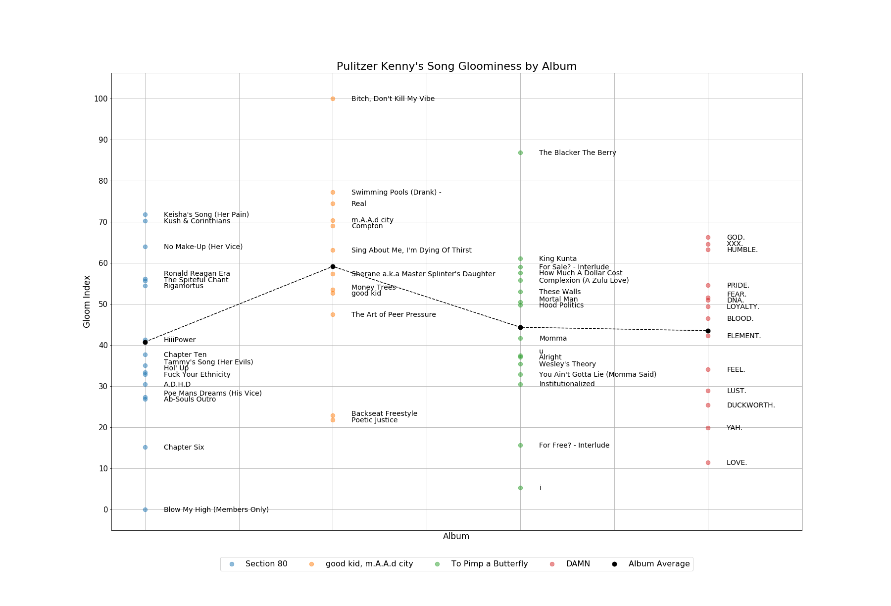

# PulitzerKenny
Sentiment analysis of Kendrick Lamar lyrics. [View enlarged data visualization](https://raw.githubusercontent.com/sanjayesn/PulitzerKenny/master/result.png)

This project leverages the Spotify and Genius APIs to collect song data and measures lyrical sentiments through the [NRC Emotion Lexicon](https://www.nrc-cnrc.gc.ca/eng/solutions/advisory/emotion_lexicons.html)

NOTE: running the Python script requires developer accounts for Spotify and Genius as credentials are required to access the APIs.

